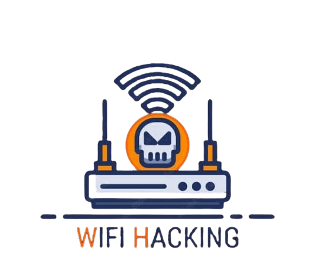

# wps-hijacker



A tool to hijack WPS (Wi-Fi Protected Setup) enabled routers.

# Wi-Fi WPS Default Pin Brute Force Attack

A tool for performing brute force attacks on Wi-Fi networks using the WPS (Wi-Fi Protected Setup) default PINs. This tool helps to identify weak Wi-Fi networks that may be vulnerable to WPS PIN-based attacks.

## Features
- Uses a predefined list of default WPS PINs for brute-forcing.
- Can be used on networks with WPS enabled.
- Simple and easy-to-use command-line interface.
- Supports multiple PIN attempts to break the WPS security.

## Requirements
- A Linux-based operating system (e.g., Kali Linux, Parrot OS).
- A compatible Wi-Fi adapter that supports monitor mode and packet injection.
- Python 3.x installed on the system.

## Installation
1. Clone the repository to your local machine:
   ```bash
   git clone https://github.com/errorsploit/wps-hijacker.git 
2. Install dependencies:
   ```bash
   pip install -r requirements.txt
---
## Author:
- Developed by: Naresh Kumar
- Instagram id:
-    ```bash
     error_sploit
---
## License:
This project is licenesd under the MIT License. See the LICENES file for details.
---
## Disclaimer:
This tool is intended for educational purposes only. Unauthorized usage on networks you do not own is illegal and unethical.
---
### *Explanation*:

1. *Header Section*:
   - The banner image (banner.png) is referenced in the README.
   - Replace "banner.png" with the actual path or URL of your image file.

2. *Social Media Links*:
   - Add your real social media handles in the "Author" section. Aap Instagram, Twitter, GitHub, LinkedIn ke links bhi de sakte hain.

3. *Image Section*:
   - Replace https://via.placeholder.com/800x200?text=WPS+Hijacker+Banner with the actual URL or local path of your image.

4. *Customization*:
   - Aap *image size* ya *content structure* change kar sakte hain apne project ke requirements ke hisaab se.

---
## Enjoy 😊
